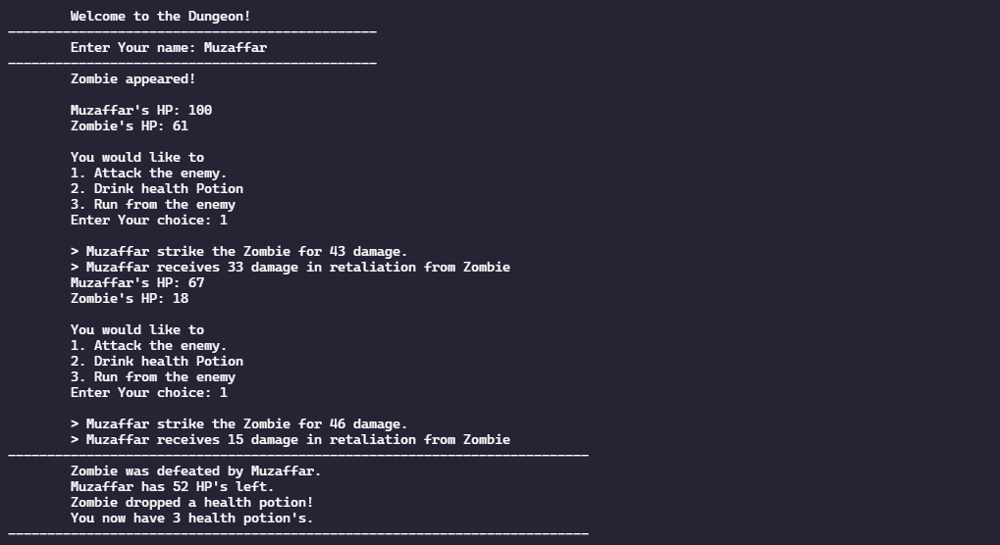

# DungeonAdventure
## Description:
A text-based adventure game is a completely text-based and very simple game.
In this game we have to play against the enemy. The enemy will be generated randomly. We have options to play the game. We can attack the enemy by pressing 1 or we can use health potion to increase our health or we can run from the current enemy and play with another enemy.
If we’ll win the game, we have 2 options, we can either continue playing the game with other enemies or we can exit the game. If the player lost the game against enemy the game gets exited with the message that the player is weak to go.

<h3 align="left">Concepts that are used: </h3>

 - Loops  
 - Unary Operators.  
 - Arithmetic Operators.  
 - Relational Operators.   
 - Strings.  
 - Control Statements.
  - Random Number Generator.  
  
  
<h3 align="left">Languages and Tools:</h3>

<h3 align="left">Output Screenshot:</h3>

 
  
  
